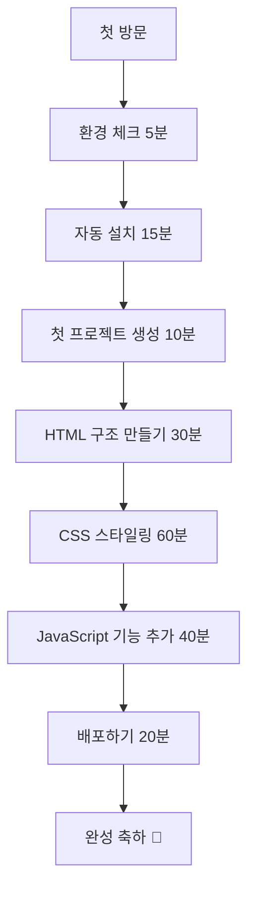

# 신승반점 랜딩페이지 개발 실습교재 웹페이지 PRD
## 100% 성공 보장형 완전초보자 맞춤 실습 플랫폼

---

## 📋 목차
1. [제품 개요](#1-제품-개요)
2. [핵심 설계 원칙](#2-핵심-설계-원칙)
3. [사용자 여정 설계](#3-사용자-여정-설계)
4. [단계별 실습 모듈](#4-단계별-실습-모듈)
5. [인터페이스 설계](#5-인터페이스-설계)
6. [오류 방지 시스템](#6-오류-방지-시스템)
7. [기술 스택 및 구현](#7-기술-스택-및-구현)

---

## 1. 제품 개요

### 1.1 비전 선언문
> **"코딩을 한 번도 해보지 않은 사람도 3시간 안에 멋진 웹사이트를 만들 수 있다"**

### 1.2 제품 정의
완전 비개발자를 위한 **Zero-Error 웹개발 실습 플랫폼**으로, 신승반점 랜딩페이지 제작을 통해 HTML, CSS, JavaScript, 배포까지의 전체 웹개발 프로세스를 학습할 수 있는 인터랙티브 교육 서비스

### 1.3 성공 지표
- **완료율**: 시작한 사용자의 95% 이상이 배포까지 완료
- **만족도**: NPS 점수 80점 이상
- **학습 시간**: 평균 3시간 이내 전체 과정 완료
- **오류율**: 각 단계별 오류 발생률 5% 미만

---

## 2. 핵심 설계 원칙

### 2.1 SIMPLE 원칙

| 원칙 | 설명 | 구현 방법 |
|------|------|----------|
| **S**tep-by-Step | 한 번에 하나씩만 | 각 화면에서 단일 액션만 요구 |
| **I**mmediate Feedback | 즉시 결과 확인 | 실시간 미리보기 제공 |
| **M**istake Prevention | 실수 방지 | 자동 검증 및 가이드 제공 |
| **P**rogress Visible | 진행상황 가시화 | 상세한 진행률 표시 |
| **L**earn by Doing | 실습 중심 학습 | 이론 최소화, 실습 최대화 |
| **E**asy Recovery | 쉬운 복구 | 자동 백업 및 복원 기능 |

### 2.2 사용자 중심 설계

#### 2.2.1 인지 부하 최소화
```
❌ 복잡한 설명: "HTML은 HyperText Markup Language의 약자로..."
✅ 간단한 비유: "HTML은 집의 뼈대 같은 것입니다"
```

#### 2.2.2 즉시 성취감 제공
- **30초 규칙**: 30초마다 눈에 보이는 변화 제공
- **작은 승리**: 각 단계별 완료시 축하 애니메이션
- **진행 가시화**: 실시간 완성도 퍼센티지 표시

---

## 3. 사용자 여정 설계

### 3.1 전체 학습 여정 (총 3시간)



3.2 단계별 상세 여정
🏁 시작 단계 (20분)
markdown1️⃣ 환경 체크 (5분)
├── 컴퓨터 사양 자동 확인
├── 브라우저 호환성 체크
└── 인터넷 연결 상태 확인

2️⃣ 원클릭 설치 (15분)
├── Node.js 자동 다운로드 & 설치
├── Cursor 자동 다운로드 & 설치
├── GitHub 계정 생성 도우미
└── 설치 완료 확인 체크리스트
🏗️ 기초 공사 (40분)
markdown3️⃣ 프로젝트 생성 (10분)
├── Cursor 실행 가이드
├── 신승반점 프로젝트 템플릿 로드
└── 폴더 구조 자동 생성

4️⃣ HTML 뼈대 만들기 (30분)
├── 헤더 섹션 작성 (5분)
├── 메뉴 소개 섹션 (10분)
├── 매장 정보 섹션 (10분)
└── 푸터 섹션 (5분)
🎨 인테리어 (60분)
markdown5️⃣ CSS 디자인 적용
├── 기본 레이아웃 (15분)
├── 색상 및 폰트 (15분)
├── 반응형 디자인 (20분)
└── 마이크로 애니메이션 (10분)
⚡ 전기 설비 (40분)
markdown6️⃣ JavaScript 기능 추가
├── 메뉴 네비게이션 (15분)
├── 이미지 갤러리 (15분)
└── 연락처 폼 (10분)
🚀 입주 완료 (20분)
markdown7️⃣ 배포 및 공개
├── GitHub 업로드 (10분)
├── Vercel 배포 (5분)
└── 실제 URL 확인 (5분)

4. 단계별 실습 모듈
4.1 모듈 1: 환경 설정 자동화
4.1.1 시스템 요구사항 자동 체크
javascript// 환경 체크 스크립트
const systemCheck = {
  os: navigator.platform,
  browser: navigator.userAgent,
  memory: navigator.deviceMemory || '확인 불가',
  connection: navigator.connection?.effectiveType || '확인 불가'
};
4.1.2 원클릭 설치 시스템
markdown🔄 자동 설치 프로세스

1. Node.js 설치
   ┌─────────────────────────────────┐
   │ [다운로드 중... ████████░░] 80% │
   │ 예상 완료 시간: 2분             │
   └─────────────────────────────────┘

2. Cursor 설치
   ┌─────────────────────────────────┐
   │ [설치 중... ██████████] 100%   │
   │ ✅ 설치 완료!                  │
   └─────────────────────────────────┘
```

#### 4.1.3 AI 프롬프트 템플릿 시스템
```markdown
🤖 **Cursor AI 프롬프트 자동 생성기**

📋 복사하기 버튼 → 자동으로 클립보드에 복사

```
@Codebase 신승반점 프로젝트를 시작해줘.

요구사항:
- 프로젝트명: shinseung-restaurant
- 인천 차이나타운 짜장면 맛집 컨셉
- 반응형 웹사이트
- 다음 구조로 설정:

📁 shinseung-restaurant/
├── 📄 index.html (메인 페이지)
├── 📁 assets/
│   ├── 📁 css/
│   ├── 📁 js/
│   └── 📁 images/
└── 📄 README.md

HTML5 기본 템플릿과 초기 CSS 파일도 함께 생성해줘.
```
```

### 4.2 모듈 2: HTML 구조 작성

#### 4.2.1 비주얼 HTML 에디터
```markdown
👆 **드래그 앤 드롭 HTML 빌더**

┌─────────────────┬─────────────────┐
│   컴포넌트 팔레트  │   실시간 미리보기    │
├─────────────────┼─────────────────┤
│ 📱 헤더           │  신승반점         │
│ 🍜 메뉴 섹션      │  [로고]           │
│ 📍 위치 정보      │  메뉴 | 위치 | 연락처│
│ 📞 연락처         │                 │
│ 📋 푸터           │  🍜 대표 메뉴     │
└─────────────────┴─────────────────┘
```

#### 4.2.2 단계별 가이드 시스템
```html
<!-- 실시간 하이라이트 및 설명 -->
<div class="guide-overlay">
  <div class="highlight-box">
    <h1>🎯 지금 작성할 부분</h1>
    <p>헤더 영역에 음식점 이름을 넣어보세요</p>
    <input type="text" placeholder="신승반점" />
    <button>추가하기</button>
  </div>
</div>
```

### 4.3 모듈 3: CSS 스타일링

#### 4.3.1 비주얼 CSS 에디터
```markdown
🎨 **스타일 조정 패널**

컬러 팔레트:
🔴 빨강 🟡 노랑 🟢 초록 🔵 파랑 ⚫ 검정

폰트 선택:
[ 나눔고딕 ▼ ] [ 크기: 16px ▼ ]

레이아웃:
┌─────┬─────┬─────┐
│ 좌측 │ 중앙 │ 우측 │  ← 클릭하여 선택
└─────┴─────┴─────┘
```

#### 4.3.2 반응형 디자인 시뮬레이터
```markdown
📱 **기기별 미리보기**

┌─ 데스크톱 ─┬─ 태블릿 ─┬─ 모바일 ─┐
│ 1920x1080 │ 768x1024 │ 375x667  │
│ [미리보기] │ [미리보기] │ [미리보기] │
└───────────┴──────────┴──────────┘
```

### 4.4 모듈 4: JavaScript 기능

#### 4.4.1 노코드 JavaScript 빌더
```markdown
⚡ **인터랙션 추가하기**

기능 선택:
☐ 메뉴 클릭시 상세 정보 표시
☐ 이미지 클릭시 확대 보기
☐ 연락처 버튼 클릭시 전화 연결
☐ 부드러운 스크롤 효과

각 기능별 자동 코드 생성 및 적용
```

### 4.5 모듈 5: 배포 자동화

#### 4.5.1 원클릭 배포 시스템
```markdown
🚀 **배포 진행 상황**

✅ 1. 파일 검증 완료
✅ 2. GitHub 업로드 완료
🔄 3. Vercel 배포 중...
⏳ 4. 도메인 연결 대기 중

완료 예상 시간: 3분
```

---

## 5. 인터페이스 설계

### 5.1 메인 레이아웃

```markdown
┌─────────────────────────────────────────────────────────┐
│ 🏠 신승반점 개발 실습    [진행률: ████████░░] 80%      │
├─────────────────────────────────────────────────────────┤
│                                                         │
│ ┌─ 단계 네비 ─┐ ┌─────── 메인 작업 영역 ──────┐ ┌─ 미리보기 ─┐│
│ │1.환경설정✅ │ │                            │ │           ││
│ │2.HTML작성🔄│ │  📝 HTML 코드 에디터         │ │ 🖥️ 실시간  ││
│ │3.CSS스타일⏳│ │                            │ │   미리보기  ││
│ │4.JS기능⏳   │ │  [코드 입력 영역]            │ │           ││
│ │5.배포⏳     │ │                            │ │ 📱 모바일  ││
│ └────────────┘ │  💡 도움말: 헤더 태그를...    │ │   미리보기  ││
│                 └─────────────────────────────┘ └───────────┘│
├─────────────────────────────────────────────────────────┤
│ 🆘 도움말  📞 1:1 지원  💬 커뮤니티  📚 자료실          │
└─────────────────────────────────────────────────────────┘
```

### 5.2 컴포넌트별 상세 설계

#### 5.2.1 진행률 표시기
```jsx
const ProgressBar = () => (
  <div className="progress-container">
    <div className="progress-bar">
      <div className="progress-fill" style={{width: '60%'}}>
        <span className="progress-text">3/5 단계 완료 (60%)</span>
      </div>
    </div>
    <div className="time-estimate">
      예상 남은 시간: 45분
    </div>
  </div>
);
```

#### 5.2.2 실시간 미리보기
```jsx
const LivePreview = () => (
  <div className="preview-container">
    <div className="device-selector">
      <button className="device-btn active">💻 데스크톱</button>
      <button className="device-btn">📱 모바일</button>
    </div>
    <iframe 
      src="/preview" 
      className="preview-frame"
      onLoad={handlePreviewUpdate}
    />
    <div className="preview-actions">
      <button>📱 반응형 테스트</button>
      <button>🔍 확대 보기</button>
    </div>
  </div>
);
```

#### 5.2.3 도움말 시스템
```jsx
const HelpSystem = () => (
  <div className="help-overlay">
    <div className="help-bubble">
      <h3>💡 이 단계에서는...</h3>
      <p>음식점의 메인 헤더를 만들어보겠습니다.</p>
      <div className="help-actions">
        <button>✅ 이해했어요</button>
        <button>❓ 더 자세히</button>
        <button>🎥 동영상 보기</button>
      </div>
    </div>
  </div>
);
```

---

## 6. 오류 방지 시스템

### 6.1 실시간 검증 시스템

#### 6.1.1 코드 자동 검증
```javascript
const codeValidator = {
  html: (code) => {
    const errors = [];
    // 닫히지 않은 태그 검사
    if (!isValidHTML(code)) {
      errors.push({
        type: 'syntax',
        message: '태그가 올바르게 닫히지 않았습니다',
        fix: '자동 수정하기',
        line: getErrorLine(code)
      });
    }
    return errors;
  },
  
  css: (code) => {
    // CSS 문법 검사
    // 자동 수정 제안
  },
  
  js: (code) => {
    // JavaScript 문법 검사
    // 보안 이슈 검사
  }
};
```

#### 6.1.2 자동 수정 제안
```markdown
🔧 **자동 수정 시스템**

❌ 발견된 문제:
```html
<div>
  <h1>신승반점
</div>
```

🔧 제안된 수정:
```html
<div>
  <h1>신승반점</h1>
</div>
```

[ 자동 수정 적용 ] [ 직접 수정하기 ]
```

### 6.2 단계별 체크포인트

#### 6.2.1 완료 조건 자동 확인
```markdown
✅ **1단계 완료 체크리스트**

환경 설정:
- [✅] Node.js 설치됨 (v18.17.0)
- [✅] Cursor 실행 가능
- [✅] GitHub 계정 연결됨
- [✅] 프로젝트 폴더 생성됨

🎉 모든 조건이 충족되었습니다!
다음 단계로 진행할 수 있습니다.

[ 다음 단계로 → ]
```

### 6.3 오류 복구 시스템

#### 6.3.1 자동 백업 및 복원
```javascript
const backupSystem = {
  autoSave: () => {
    // 30초마다 자동 저장
    setInterval(() => {
      const currentState = getCurrentProjectState();
      localStorage.setItem('projectBackup', JSON.stringify(currentState));
    }, 30000);
  },
  
  restore: () => {
    const backup = localStorage.getItem('projectBackup');
    if (backup) {
      return JSON.parse(backup);
    }
    return null;
  }
};
```

---

## 7. 기술 스택 및 구현

### 7.1 프론트엔드 아키텍처

#### 7.1.1 Next.js 프로젝트 구조
```
📁 shinseung-learning-platform/
├── 📁 pages/
│   ├── 📄 index.js                    # 홈페이지
│   ├── 📁 tutorial/
│   │   ├── 📄 step-1-setup.js         # 환경설정
│   │   ├── 📄 step-2-html.js          # HTML 작성
│   │   ├── 📄 step-3-css.js           # CSS 스타일링
│   │   ├── 📄 step-4-javascript.js    # JavaScript 기능
│   │   └── 📄 step-5-deploy.js        # 배포
│   └── 📁 api/
│       ├── 📄 validate-code.js        # 코드 검증
│       ├── 📄 auto-fix.js             # 자동 수정
│       └── 📄 deploy.js               # 배포 API
├── 📁 components/
│   ├── 📁 layout/
│   │   ├── 📄 Header.jsx              # 상단 헤더
│   │   ├── 📄 Sidebar.jsx             # 사이드바 네비게이션
│   │   └── 📄 ProgressBar.jsx         # 진행률 표시
│   ├── 📁 editor/
│   │   ├── 📄 CodeEditor.jsx          # 코드 에디터
│   │   ├── 📄 LivePreview.jsx         # 실시간 미리보기
│   │   └── 📄 ErrorChecker.jsx        # 오류 검사기
│   ├── 📁 tutorial/
│   │   ├── 📄 StepGuide.jsx           # 단계별 가이드
│   │   ├── 📄 HelpSystem.jsx          # 도움말 시스템
│   │   └── 📄 CheckpointValidator.jsx # 체크포인트 검증
│   └── 📁 ui/
│       ├── 📄 Button.jsx              # 공통 버튼
│       ├── 📄 Modal.jsx               # 모달 창
│       └── 📄 Toast.jsx               # 알림 메시지
├── 📁 styles/
│   ├── 📄 globals.css                 # 전역 스타일
│   ├── 📄 tutorial.module.css         # 튜토리얼 스타일
│   └── 📄 editor.module.css           # 에디터 스타일
├── 📁 public/
│   ├── 📁 images/
│   │   ├── 🖼️ shinseung-logo.png      # 신승반점 로고
│   │   ├── 🖼️ tutorial-preview.png   # 튜토리얼 미리보기
│   │   └── 📁 icons/                  # 아이콘 모음
│   ├── 📁 templates/
│   │   └── 📄 restaurant-template.zip # 프로젝트 템플릿
│   └── 📁 videos/
│       └── 🎥 step-by-step-guide.mp4  # 단계별 가이드 영상
├── 📁 lib/
│   ├── 📄 codeValidator.js            # 코드 검증 로직
│   ├── 📄 autoFixer.js                # 자동 수정 로직
│   ├── 📄 deployHelper.js             # 배포 도우미
│   └── 📄 progressTracker.js          # 진행률 추적
├── 📁 data/
│   ├── 📄 tutorial-steps.json         # 튜토리얼 단계 데이터
│   ├── 📄 error-messages.json         # 오류 메시지 데이터
│   └── 📄 help-content.json           # 도움말 콘텐츠
└── 📁 hooks/
    ├── 📄 useCodeEditor.js            # 코드 에디터 훅
    ├── 📄 useProgress.js              # 진행률 관리 훅
    └── 📄 useAutoSave.js              # 자동 저장 훅
```

#### 7.1.2 핵심 컴포넌트 구현

##### CodeEditor 컴포넌트
```jsx
import { Monaco } from '@monaco-editor/react';
import { useCodeValidator } from '../hooks/useCodeValidator';

const CodeEditor = ({ language, value, onChange, stepId }) => {
  const { errors, warnings, autoFix } = useCodeValidator(value, language);
  
  return (
    <div className="code-editor-container">
      <div className="editor-header">
        <span className="language-tag">{language.toUpperCase()}</span>
        <div className="editor-actions">
          <button onClick={autoFix} disabled={!errors.length}>
            🔧 자동 수정
          </button>
          <button onClick={() => {}}>
            📋 코드 복사
          </button>
        </div>
      </div>
      
      <Monaco
        height="400px"
        language={language}
        value={value}
        onChange={onChange}
        theme="vs-dark"
        options={{
          fontSize: 14,
          minimap: { enabled: false },
          scrollBeyondLastLine: false,
          automaticLayout: true,
          wordWrap: 'on'
        }}
      />
      
      {errors.length > 0 && (
        <div className="error-panel">
          {errors.map(error => (
            <div key={error.id} className="error-item">
              <span className="error-icon">❌</span>
              <span className="error-message">{error.message}</span>
              <button onClick={() => autoFix(error.id)}>
                수정하기
              </button>
            </div>
          ))}
        </div>
      )}
    </div>
  );
};
```

##### LivePreview 컴포넌트
```jsx
const LivePreview = ({ htmlCode, cssCode, jsCode }) => {
  const [previewUrl, setPreviewUrl] = useState('');
  const [device, setDevice] = useState('desktop');
  
  useEffect(() => {
    const blob = new Blob([
      generatePreviewHTML(htmlCode, cssCode, jsCode)
    ], { type: 'text/html' });
    
    const url = URL.createObjectURL(blob);
    setPreviewUrl(url);
    
    return () => URL.revokeObjectURL(url);
  }, [htmlCode, cssCode, jsCode]);
  
  return (
    <div className="preview-container">
      <div className="preview-toolbar">
        <div className="device-selector">
          <button 
            className={device === 'desktop' ? 'active' : ''}
            onClick={() => setDevice('desktop')}
          >
            💻 데스크톱
          </button>
          <button 
            className={device === 'mobile' ? 'active' : ''}
            onClick={() => setDevice('mobile')}
          >
            📱 모바일
          </button>
        </div>
        
        <div className="preview-actions">
          <button onClick={refreshPreview}>🔄 새로고침</button>
          <button onClick={openInNewTab}>🔗 새 탭에서 열기</button>
        </div>
      </div>
      
      <div className={`preview-frame ${device}`}>
        <iframe
          src={previewUrl}
          width="100%"
          height="100%"
          frameBorder="0"
          title="Live Preview"
        />
      </div>
    </div>
  );
};
```

### 7.2 데이터 관리 및 상태

#### 7.2.1 진행률 추적 시스템
```javascript
// hooks/useProgress.js
export const useProgress = () => {
  const [progress, setProgress] = useState(() => {
    const saved = localStorage.getItem('tutorial-progress');
    return saved ? JSON.parse(saved) : {
      currentStep: 1,
      completedSteps: [],
      timeSpent: 0,
      lastVisit: new Date().toISOString()
    };
  });
  
  const updateProgress = (stepId, completed = true) => {
    setProgress(prev => {
      const updated = {
        ...prev,
        currentStep: completed ? stepId + 1 : stepId,
        completedSteps: completed 
          ? [...prev.completedSteps, stepId]
          : prev.completedSteps,
        lastVisit: new Date().toISOString()
      };
      
      localStorage.setItem('tutorial-progress', JSON.stringify(updated));
      return updated;
    });
  };
  
  return { progress, updateProgress };
};
```

#### 7.2.2 자동 저장 시스템
```javascript
// hooks/useAutoSave.js
export const useAutoSave = (data, interval = 30000) => {
  const [lastSaved, setLastSaved] = useState(null);
  
  useEffect(() => {
    const timer = setInterval(() => {
      const backup = {
        data,
        timestamp: new Date().toISOString(),
        stepId: getCurrentStepId()
      };
      
      localStorage.setItem('project-backup', JSON.stringify(backup));
      setLastSaved(new Date());
    }, interval);
    
    return () => clearInterval(timer);
  }, [data, interval]);
  
  const restore = () => {
    const backup = localStorage.getItem('project-backup');
    return backup ? JSON.parse(backup) : null;
  };
  
  return { lastSaved, restore };
};
```

### 7.3 API 및 서비스

#### 7.3.1 코드 검증 API
```javascript
// pages/api/validate-code.js
export default async function handler(req, res) {
  const { code, language, stepId } = req.body;
  
  try {
    const validator = getValidator(language);
    const results = await validator.validate(code, stepId);
    
    res.status(200).json({
      success: true,
      errors: results.errors,
      warnings: results.warnings,
      suggestions: results.suggestions,
      autoFixAvailable: results.canAutoFix
    });
  } catch (error) {
    res.status(500).json({
      success: false,
      message: '코드 검증 중 오류가 발생했습니다.'
    });
  }
}
```

#### 7.3.2 배포 도우미 API
```javascript
// pages/api/deploy.js
export default async function handler(req, res) {
  const { projectData, githubToken } = req.body;
  
  try {
    // 1. GitHub 리포지토리 생성
    const repo = await createGitHubRepo(projectData, githubToken);
    
    // 2. 파일 업로드
    await uploadProjectFiles(repo, projectData.files);
    
    // 3. Vercel 배포 트리거
    const deployment = await triggerVercelDeploy(repo);
    
    res.status(200).json({
      success: true,
      repoUrl: repo.html_url,
      deploymentUrl: deployment.url,
      message: '배포가 완료되었습니다!'
    });
  } catch (error) {
    res.status(500).json({
      success: false,
      message: '배포 중 오류가 발생했습니다.',
      error: error.message
    });
  }
}
```

### 7.4 성능 최적화

#### 7.4.1 코드 분할 및 레이지 로딩
```javascript
// 동적 컴포넌트 로딩
const CodeEditor = dynamic(() => import('../components/CodeEditor'), {
  loading: () => <div>에디터 로딩 중...</div>,
  ssr: false
});

const LivePreview = dynamic(() => import('../components/LivePreview'), {
  loading: () => <div>미리보기 로딩 중...</div>,
  ssr: false
});
```

#### 7.4.2 이미지 최적화
```jsx
import Image from 'next/image';

const TutorialImage = ({ src, alt, step }) => (
  <div className="tutorial-image">
    <Image
      src={src}
      alt={alt}
      width={800}
      height={450}
      priority={step <= 2} // 첫 2단계는 우선 로딩
      placeholder="blur"
      blurDataURL="data:image/jpeg;base64,/9j/4AAQSkZJRgABAQAAAQ..."
    />
  </div>
);
```

### 7.5 배포 및 DevOps

#### 7.5.1 환경 설정
```javascript
// next.config.js
module.exports = {
  env: {
    GITHUB_CLIENT_ID: process.env.GITHUB_CLIENT_ID,
    VERCEL_TOKEN: process.env.VERCEL_TOKEN
  },
  
  images: {
    domains: ['raw.githubusercontent.com', 'images.unsplash.com']
  },
  
  webpack: (config, { isServer }) => {
    if (!isServer) {
      config.resolve.fallback = {
        fs: false,
        path: false
      };
    }
    return config;
  }
};
```

#### 7.5.2 CI/CD 파이프라인
```yaml
# .github/workflows/deploy.yml
name: Deploy to Vercel

on:
  push:
    branches: [main]

jobs:
  deploy:
    runs-on: ubuntu-latest
    steps:
      - uses: actions/checkout@v2
      
      - name: Setup Node.js
        uses: actions/setup-node@v2
        with:
          node-version: '18'
          
      - name: Install dependencies
        run: npm ci
        
      - name: Run tests
        run: npm test
        
      - name: Build project
        run: npm run build
        
      - name: Deploy to Vercel
        uses: amondnet/vercel-action@v20
        with:
          vercel-token: ${{ secrets.VERCEL_TOKEN }}
          vercel-org-id: ${{ secrets.ORG_ID }}
          vercel-project-id: ${{ secrets.PROJECT_ID }}
```

---

## 8. 품질 보증 및 테스트

### 8.1 사용자 테스트 시나리오

#### 8.1.1 완전 초보자 테스트
```markdown
👤 **테스트 페르소나: 김영희 (50대, 카페 사장)**

시나리오:
1. 웹사이트 첫 방문
2. 아무런 사전 지식 없이 튜토리얼 시작
3. 각 단계별 완료 시간 측정
4. 발생하는 질문 및 막히는 지점 기록
5. 최종 완성도 평가

성공 기준:
- 3시간 내 완료
- 외부 도움 없이 독립적 완료
- 만족도 8점/10점 이상
```

#### 8.1.2 A/B 테스트 요소
```markdown
🧪 **A/B 테스트 항목**

1. 설명 방식
   - A: 기술적 설명 (HTML은 마크업 언어...)
   - B: 비유적 설명 (HTML은 집의 뼈대...)

2. 진행률 표시
   - A: 퍼센티지 (60% 완료)
   - B: 단계별 (3/5 단계 완료)

3. 에러 메시지
   - A: 기술적 메시지 (Syntax Error on line 15)
   - B: 친화적 메시지 (태그가 제대로 닫히지 않았어요)
```

### 8.2 자동화된 품질 검사

#### 8.2.1 코드 품질 검사
```javascript
// 자동 코드 리뷰 시스템
const codeQualityChecker = {
  checkHTML: (code) => {
    return {
      accessibility: checkA11y(code),
      semantics: checkSemanticHTML(code),
      structure: checkHTMLStructure(code),
      score: calculateScore(code)
    };
  },
  
  checkCSS: (code) => {
    return {
      responsiveness: checkResponsive(code),
      performance: checkCSSPerf(code),
      consistency: checkNamingConvention(code),
      score: calculateScore(code)
    };
  }
};
```

### 8.3 성능 모니터링

#### 8.3.1 실시간 성능 추적
```javascript
// 성능 메트릭 수집
const performanceTracker = {
  trackUserJourney: () => {
    // 각 단계별 완료 시간
    // 이탈 지점 분석
    // 도움말 사용 빈도
  },
  
  trackSystemPerformance: () => {
    // 페이지 로딩 속도
    // API 응답 시간
    // 에러 발생률
  }
};
```

---

## 9. 런칭 및 운영 계획

### 9.1 베타 테스트 (2주)

#### 9.1.1 베타 테스터 모집
```markdown
📢 **베타 테스터 모집**

대상:
- 웹개발 경험이 전혀 없는 소상공인 20명
- 대학생 (비전공자) 20명
- 직장인 (비개발 직군) 10명

테스트 내용:
- 전체 튜토리얼 완주
- 사용성 피드백 수집
- 버그 리포트 작성
- 개선 사항 제안
```

#### 9.1.2 베타 테스트 결과 분석
```markdown
📊 **예상 결과 분석**

성공 지표:
- 완료율 85% 이상
- 평균 완료 시간 3.5시간 이하
- 만족도 8점/10점 이상
- 재방문 의향 90% 이상

개선 영역:
- UI/UX 개선점
- 콘텐츠 난이도 조절
- 오류 처리 고도화
- 성능 최적화
```

### 9.2 정식 런칭 (1주)

#### 9.2.1 런칭 이벤트
```markdown
🎉 **그랜드 오픈 이벤트**

이벤트 내용:
- 선착순 100명 무료 1:1 멘토링
- 완주 인증시 수료증 발급
- 우수 작품 상금 지급
- SNS 공유 이벤트

마케팅 채널:
- 소상공인 커뮤니티
- 대학교 창업 동아리
- 직장인 스터디 그룹
- 유튜브 인플루언서 협업
```

### 9.3 지속적 개선

#### 9.3.1 사용자 피드백 수집
```markdown
📝 **피드백 수집 시스템**

수집 방법:
- 각 단계 완료시 만족도 조사
- 튜토리얼 완료 후 상세 리뷰
- 월 1회 사용자 인터뷰
- 커뮤니티 의견 모니터링

분석 지표:
- 단계별 이탈률
- 평균 완료 시간
- 도움말 사용 패턴
- 에러 발생 빈도
```

#### 9.3.2 콘텐츠 확장 계획
```markdown
🚀 **로드맵 (6개월)**

Phase 1 (출시 후 1개월):
- 버그 수정 및 최적화
- 모바일 앱 버전 개발

Phase 2 (출시 후 3개월):
- 고급 기능 추가 (JavaScript 심화)
- 다양한 업종별 템플릿 제공

Phase 3 (출시 후 6개월):
- AI 맞춤형 학습 경로
- 실시간 협업 기능
- 커뮤니티 마켓플레이스
```

---

이 PRD를 통해 완전 초보자도 100% 성공할 수 있는 신승반점 랜딩페이지 개발 실습교재 웹페이지를 구축할 수 있습니다. 핵심은 사용자의 인지 부하를 최소화하고, 실시간 피드백과 자동 오류 수정을 통해 좌절 없이 학습할 수 있는 환경을 제공하는 것입니다.