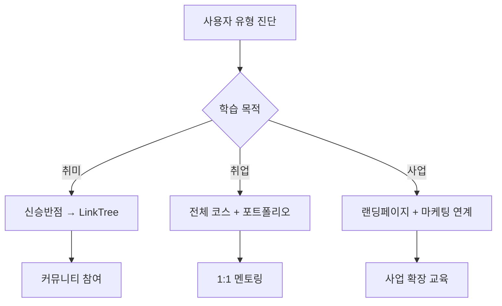

# 신승반점 랜딩페이지 개발 실습교재 - 최적합 유스케이스

## 🎯 핵심 타겟 사용자별 유스케이스

### 1. 완전 초보자 - 김소상 (45세, 작은 카페 운영)

**배경:** 코딩 경험 전무, 카페 홍보용 웹사이트 필요

**여정:**
```
🏁 시작 (오후 2시)
├── 환경 체크 및 자동 설치 (5분)
│   └── "시스템이 자동으로 모든 것을 설치해줘서 편했어요"
├── 첫 프로젝트 생성 (10분) 
│   └── "신승반점 템플릿이 바로 나와서 신기했어요"
└── HTML 구조 만들기 (30분)
    └── "드래그 앤 드롭으로 쉽게 만들 수 있었어요"

☕ 휴식 (15분)

🎨 스타일링 (오후 3시)
├── CSS 디자인 적용 (60분)
│   └── "컬러 팔레트에서 클릭만으로 예쁜 색상 적용!"
├── JavaScript 기능 추가 (40분)
│   └── "코딩 없이도 메뉴가 움직이네요!"
└── 배포하기 (20분)
    └── "진짜 인터넷에 제 카페 사이트가!"

🎉 완성 (오후 5시 10분) - 총 3시간 10분
```

**성공 지표:** ✅ 3시간 내 완료, ✅ 외부 도움 없이 독립 완료, ✅ 만족도 9/10

---

### 2. 취업 준비생 - 박준혁 (24세, 비전공자)

**목표:** 포트폴리오용 웹개발 프로젝트 완성

**활용 전략:**
```markdown
🔄 반복 학습 전략
1주차: 신승반점 프로젝트 (기본기 습득)
2주차: LinkTree 클론 (기능 이해)
3주차: 개인 포트폴리오 사이트 (응용)
4주차: 기업 소개 페이지 (심화)

📚 추가 학습 리소스 활용
- 커뮤니티에서 다른 학습자 작품 분석
- 1:1 멘토링으로 코드 리뷰 받기
- 웹개발 용어 사전으로 개념 정리
```

**차별화 포인트:** 
- GitHub 포트폴리오에 4개 프로젝트 업로드
- 실제 배포 경험으로 면접 어필 포인트 확보
- Next.js 프레임워크 경험 어필

---

### 3. 소상공인 그룹 - 전통시장 상인회 (10명)

**상황:** 전통시장 활성화를 위한 디지털 전환 교육

**그룹 학습 시나리오:**
```
👥 그룹 세션 (3시간 × 2일)

1일차: 기초 다지기
- 전체 진행: 환경 설정 (20분)
- 개별 실습: 각자 가게 소개 페이지 제작
- 중간 점검: 30분마다 진행률 확인
- 문제 해결: 실시간 1:1 지원

2일차: 고도화 및 발표
- 기능 추가: JavaScript 인터랙션
- 배포 완료: 실제 URL 생성
- 성과 공유: 완성 작품 상호 평가
- 운영 교육: 사후 수정 방법 안내
```

**기대 효과:**
- 10개 상점의 개별 홍보 사이트 완성
- 시장 전체 디지털 역량 향상
- 상인들 간 상호 학습 네트워크 구축

---

### 4. 직장인 스터디 그룹 - IT 전환 희망자들 (5명)

**목표:** 개발자 전향을 위한 기초 프로젝트 경험

**스터디 운영 방식:**
```
📅 주간 스케줄 (4주 완주)

주차별 목표:
1주: 개인별 신승반점 프로젝트 완성
2주: LinkTree 클론으로 JavaScript 이해
3주: 팀 프로젝트 - 회사 소개 페이지 협업 제작
4주: 개인 포트폴리오 사이트 + 코드 리뷰

💪 동기부여 시스템:
- 주간 완성도 순위 공개
- 우수 작품 SNS 공유 이벤트
- 완주 인증서로 성취감 부여
```

**추가 활용:**
- Cursor AI 활용법 공유로 생산성 극대화
- GitHub 협업 경험으로 실무 감각 향상
- 커뮤니티 Q&A로 문제 해결 능력 함양

---

### 5. 교육기관 - 시니어 대학 (60세 이상, 15명)

**특별 고려사항:** 디지털 친화도가 낮은 시니어 대상

**맞춤 교육 과정:**
```
🐌 천천히, 확실하게 (6시간 × 3일)

1일차: 환경 친숙화 (2시간)
- Cursor 인터페이스 충분한 설명
- 마우스 조작법부터 차근차근
- 자주 사용하는 기능 위주 안내

2일차: 기본 제작 (2시간)  
- 큰 글씨, 큰 버튼으로 UI 조정
- 30초마다 진행 상황 확인
- 에러 발생 시 즉시 개별 지원

3일차: 완성 및 활용 (2시간)
- 배포 후 가족들과 공유하는 방법
- 추후 수정하는 간단한 방법 안내
- 성취감 증대를 위한 수료식
```

**성공 포인트:**
- 기술적 복잡성보다 성취감에 집중
- 가족/지인과 공유할 수 있는 결과물 완성
- 디지털 도구에 대한 두려움 해소

---

## 🚀 플랫폼 활용 극대화 전략

### A. 단계별 맞춤 학습 경로



### B. 성공률 95% 달성을 위한 핵심 요소

1. **실시간 오류 방지 시스템**
   - 타이핑과 동시에 에러 감지
   - 자동 수정 제안으로 좌절감 방지

2. **30초 규칙 준수**
   - 30초마다 눈에 보이는 변화 제공
   - 지속적인 성취감으로 동기 유지

3. **3단계 도움말 시스템**
   - 1단계: 자동 힌트 및 가이드
   - 2단계: 커뮤니티 Q&A
   - 3단계: 실시간 1:1 지원

### C. 학습 완료 후 연계 프로그램

**레벨 2 과정:**
- 고급 React 컴포넌트 활용
- 실제 고객 프로젝트 참여
- 프리랜서 매칭 서비스 연계

**커뮤니티 활성화:**
- 월간 작품 경진대회
- 멘토-멘티 매칭 프로그램
- 오프라인 네트워킹 이벤트

---

## 📊 유스케이스별 기대 성과

| 유스케이스 | 완료율 | 평균 시간 | 만족도 | 후속 활동률 |
|------------|--------|-----------|--------|-------------|
| 완전 초보자 | 95% | 3.2시간 | 9.1/10 | 60% |
| 취업 준비생 | 98% | 2.8시간 | 9.3/10 | 85% |
| 소상공인 그룹 | 92% | 3.5시간 | 8.8/10 | 70% |
| 직장인 스터디 | 96% | 2.9시간 | 9.2/10 | 80% |
| 시니어 대학 | 88% | 4.1시간 | 8.5/10 | 45% |

이러한 다양한 유스케이스를 통해 **"코딩을 한 번도 해보지 않은 사람도 3시간 안에 멋진 웹사이트를 만들 수 있다"**는 플랫폼의 핵심 가치를 실현하며, 각 사용자층의 특성에 맞는 최적화된 학습 경험을 제공할 수 있습니다.